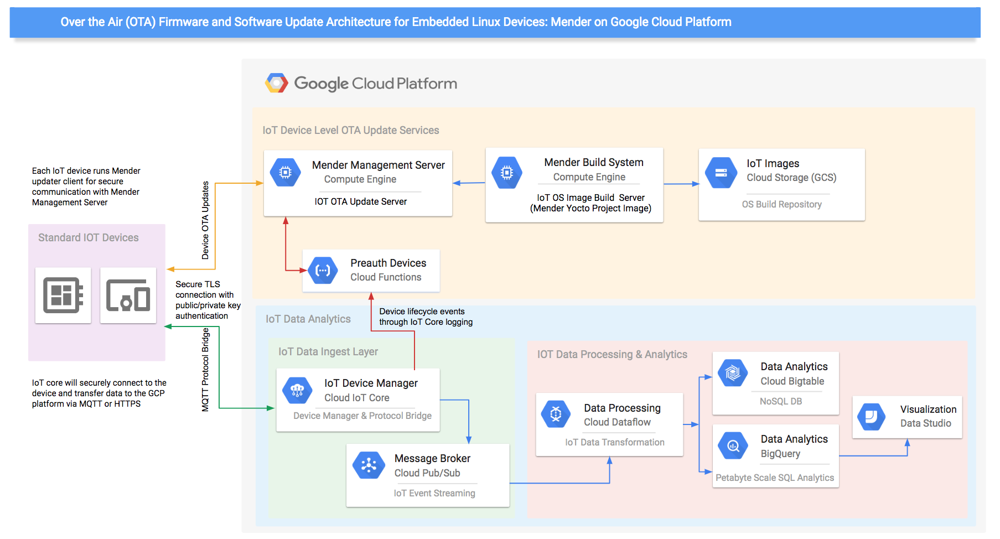
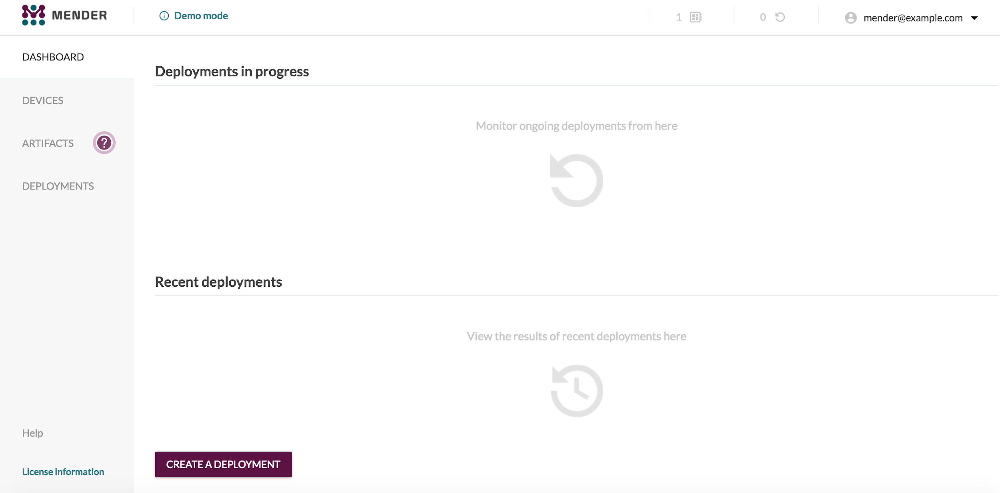
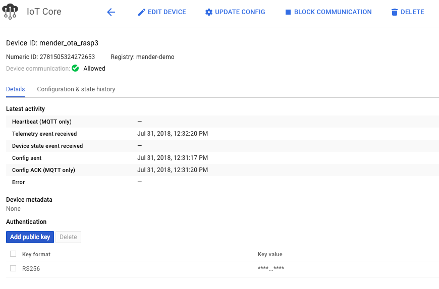

## **Tutorial: Over-the-air software updates for embedded Linux with Mender on Google Cloud Platform**

This tutorial demonstrates how to successfully deploy over-the-air (OTA) software update solution for embedded Linux devices using Mender on Google Cloud Platform.

### Background

##### Mender Overview

Mender is an open source remote update manager for embedded Linux devices. The aim of the project is to help secure connected devices by providing a robust and easy software update process.

Some of the key features of Mender include

* OTA update server and client

* Full system image update

* Symmetric A/B image update client

* Bootloader support: U-Boot and GRUB

* Volume formats: MBR and UEFI partitions

* Update commit and roll-back

* Build system: Yocto Project (meta-mender)

* Remote features: deployment server, build artifact management, device management console

More information on Mender can be found [here](https://mender.io/) including [What is Mender and How it works](https://mender.io/what-is-mender)

##### Mender Components

* **Mender management server** - Mender Management Server, which is the central point for deploying updates to a population of devices. Among other things, it monitors the current software version that is installed on each device and schedules the rollout of new releases.

* **Mender build system** - Software build system generates a new version of software for a device. The software build system is a standard component, such as the Yocto Project. It creates build artifacts in the format required by the target device. There will be different build artifacts for each type of device being managed.

* **Mender Client -** Each device runs a copy of the Mender update client, which polls the Management Server from time to time to report its status and to discover if there is a software update waiting. If there is, the update client downloads and installs it.

### Mender on Google Cloud Platform (GCP)

This section provides a high level architecture overview of Mender on GCP and detailed instructions for deploying the Mender Management Server, Building Mender artifacts and client configuration including integration with GCP IoT Core.

#### Mender on GCP - High Level Architecture Diagram:

The following architecture diagram provides a high level overview of the various components on GCP to enable OTA updates with Mender and Google Cloud IOT Core



#### Mender Management Server Deployment Options :

There are several options for successfully setting up Mender services with Google Cloud Platform (GCP), this tutorial will use a minimally configured Mender Management Production Server to test the end to end workflow:

* [Mender Management Demo Server](https://docs.mender.io/getting-started/create-a-test-environment) - For quickly testing the Mender server, Mender provides a  pre-built demo version that does not take into account production-grade issues like security and scalability

* [Mender Management Production Server](https://docs.mender.io/administration/production-installation) - Mender Server for production environments, and includes security and reliability aspects of Mender production installations.

* [Hosted Mender Service](https://mender.io/signup)  - Hosted Mender is a secure management service so you don't have to spend time maintaining security, certificates, uptime, upgrades and compatibility of the Mender server. Simply point your Mender clients to the Hosted Mender service.

### Mender on GCP Setup Instructions (Tutorial)

#### Mender Management Server on Google Cloud 

Mender Management server requirements from Mender are outlined [here](https://docs.mender.io/getting-started/requirements) and we will be using the base instructions as documented for setting up a production environment and deploy on Google Cloud Platform, however this is minimally configured and not suited for actual production use. 

###### Before you begin

Please review the billable components of the GCP for this tutorial and pre-requisites below.

###### Costs

This tutorial uses billable components of GCP, including:

* Cloud IoT Core

* Cloud PubSub

* Google Compute Engine

* Google Cloud Storage

* Cloud Functions for Firebase

* Stackdriver Logging

###### Pre-requisites:

This tutorial assumes you already have a Cloud Platform account set up and have completed the [getting started guide](https://cloud.google.com/iot/docs/how-tos/getting-started) including enabling the Cloud IoT Core API. You need to associate Firebase to your cloud project. To add Firebase to your cloud project please visit the [Firebase Console](https://console.firebase.google.com) choose "Add project" and select your cloud project and click on “Add Firebase”.

* Install the [Google Cloud SDK ](https://cloud.google.com/sdk/downloads)if you prefer to use local terminal over [Google Cloud Shell](https://cloud.google.com/shell/docs/quickstart)

* Demo environment variables from Google Cloud Shell or local terminal (Please use the below variables for every new session)

###### Setup the "cloud api shell" environment (you will use several different shell environments)

* If you do not already have a development environment set up with [gcloud](https://cloud.google.com/sdk/install) and [Firebase](https://firebase.google.com/docs/cli/) tools, it is recommended that you use [Cloud Shell](https://cloud.google.com/shell/docs/) for command line instructions that don't involve SSH to devices on your local network.

```
gcloud auth login
```

```
gcloud config set project MY-PROJECT # replace with the name of your project
```

```
gcloud services enable compute.googleapis.com
```


```
gcloud compute firewall-rules create mender-ota-443 --allow tcp:443
gcloud compute firewall-rules create mender-ota-9000 --allow tcp:9000
```

```
export FULL_PROJECT=$(gcloud config list project --format "value(core.project)")
export PROJECT="$(echo $FULL_PROJECT | cut -f2 -d ':')"
export CLOUD_REGION='us-central1'
```

Create two Cloud Storage buckets you will use for updates and storage:

```
gsutil mb -l $CLOUD_REGION gs://$PROJECT-mender-server
gsutil mb -l $CLOUD_REGION gs://$PROJECT-mender-builds
```

###### Installing Mender Management Server on GCP

* Step 1: Create a Google Cloud Compute Engine and run a [startup script](https://cloud.google.com/compute/docs/startupscript) to install various dependencies including Docker, as well as installing and starting the [Mender Server](https://docs.mender.io/administration/production-installation).

```
gcloud beta compute --project $PROJECT instances create "mender-ota-demo" --zone "us-central1-c" --machine-type "n1-standard-2" --subnet "default" --maintenance-policy "MIGRATE" --scopes "https://www.googleapis.com/auth/cloud-platform" --metadata=startup-script-url=https://raw.githubusercontent.com/Kcr19/community/master/tutorials/mender_gcp_ota_demo/server/mender_server_install.sh --min-cpu-platform "Automatic" --tags "https-server" --image "ubuntu-1604-xenial-v20180814" --image-project "ubuntu-os-cloud" --boot-disk-size "10" --boot-disk-type "pd-standard" --boot-disk-device-name "mender-ota-demo"
```


Note: Please note the startup script will take roughly 3-5 minutes to completely install all the prerequisites including Docker CE, Docker compose and Mender Server.

* Step 2 : Navigate to the Mender UI by clicking on the external IP address of "mender-ota-demo" which can be found from the [GCP console → Compute Engine](https://console.cloud.google.com/compute). If you are using Chrome as your web browser you might get a certificate warning and you will need to click “advanced” and “proceed”. In an actual production environment, you would provision this server with a trusted certificate.


* Once you are the Mender UI login screen please login using credentials created in the above step which should take the Mender Dashboard. 

    * Username - [mender@example.com](mailto:mender@example.com)

    * Password - mender_gcp_ota



Congrats you just finished creating the Mender Server on Google Cloud Platform. 

##### Hosted Mender Service

The above steps are for self-managed Open Source Mender Management Server on GCP,Mender also provides fully managed [Hosted Mender service](https://mender.io/signup) .   

The next section describes how to build a Yocto Project image for a raspberry Pi3 device.

#### Mender Build Server on GCP

##### Build a Mender Yocto project OS image for Raspberry Pi3 device

These steps outline how to build a Yocto Project image for a Raspberry Pi3 device. 

The [Yocto Project](https://www.yoctoproject.org/) is an open source collaboration project that helps developers create custom Linux-based systems for embedded products, regardless of the hardware architecture. 

The build output includes a file that can be flashed to the device storage during initial provisioning, it has suffix ."sdimg. Additionally copies of the same image with ".img” and “.bmap” suffix are uploaded to GCS bucket.

Yocto image builds generally take a while to complete. Generally instances with high CPU cores and memory along with faster disks such as SSD will help speed up the overall build process. Additionally, there are pre-built images for quick testing available in the GCS bucket which you can download and proceed directly to "Working with pre-built Mender Yocto Images" section

Below are the instructions to build a custom Mender Yocto image for Raspberry Pi3 device. This image will have a number of requirements needed to communicate with IoT Core built in.

Use the *"cloud api shell" environment you used earlier.*

1. Create a GCE instance for Mender Yocto Project OS builds:

```
gcloud beta compute --project $PROJECT instances create "mender-ota-build" --zone "us-central1-c" --machine-type "n1-standard-16" --subnet "default" --maintenance-policy "MIGRATE" --scopes "https://www.googleapis.com/auth/cloud-platform" --min-cpu-platform "Automatic" --tags "https-server" --image "ubuntu-1604-xenial-v20180405" --image-project "ubuntu-os-cloud" --boot-disk-size "150" --boot-disk-type=pd-ssd --boot-disk-device-name "mender-ota-build"
```


2. SSH into the image and install the necessary updates required for the Yocto Project Builds

```
gcloud compute --project $PROJECT ssh --zone "us-central1-c" "mender-ota-build"
```


3. Install the Mender Yocto custom image build including dependencies by downloading script from the below github repo and executing on the build server. 

This step initially builds a custom image for Raspberry Pi device as well as mender artifact update which can be used to test the OTA feature of Mender. All images after the completion of the build are automatically uploaded into GCS bucket.

Note that you are now switching to the "build server shell" environment, and not in the "cloud api shell" environment.

```
export GCP_IOT_MENDER_DEMO_HOST_IP_ADDRESS=$(gcloud compute instances describe mender-ota-demo --format="value(networkInterfaces.accessConfigs[0].natIP)")
```

```
wget https://raw.githubusercontent.com/Kcr19/community/master/tutorials/mender_gcp_ota_demo/image/mender-gcp-build.sh
```

```
chmod +x ./mender-gcp-build.sh
```

```
. ./mender-gcp-build.sh
```


**Note:** *The build process will generally take anywhere from **45 minutes to 60 minutes** and will create custom embedded Linux image with all the necessary packages and dependencies to be able to connect to Google Cloud IoT Core. The output of the build will be (2) files which will be uploaded into Google Cloud Storage Bucket. *

1. *gcp-mender-demo-image-raspberrypi3.sdimg - This will be the core image files which will be used by the client to connect to GCP IoT core and Mender Server. Copy of the same image file with ".bmap" and “.img” are also generated and uploaded to GCS bucket.*

2. *gcp-mender-demo-image-raspberrypi3.mender - This will be the mender artifact file which you will upload to the mender server and deploy on the client as part of the OTA update process.*

4. This completes the build process, the next step is to provision the build to [new device](https://docs.mender.io/artifacts/provisioning-a-new-device) (Raspberry Pi3). The build image was copied automatically to the GCS bucket which was created earlier. 

Download the newly built image to your local PC where you can write the image to SD card as outlined in the next step. Note: this is done only for the initial provisioning of the starter image to a new device. Updates from this point on are managed by Mender.

```
gsutil cp gs//$PROJECT-mender-builds/gcp-mender-demo-image-raspberrypi3.sdimg  /<local PC path where you want to write the image to>
```


5. Provisioning a new device (Writing the image to Raspberry Pi3 device)

    * Insert the SD card into the SD card slot of your local PC where you have the "gcp-mender-demo-image-raspberrypi3.sdimg" image downloaded. If you are using a utility such as [Etcher](https://etcher.io/) please use the image with “.img” suffix - “gcp-mender-demo-image-raspberrypi3.img” which can be downloaded from the same GCS bucket as above and skip the steps below.

    * Unmount the drive (instructions below for Mac)

```
df  -h  (Use this command to determine where the drive is mounted)
```
```
# on OS X: 
diskutil unmountDisk /dev/disk3 (assuming /dev/disk 3 is SD card)
```
```
# on Linux:
umount <mount-path>
```
  	 
Command to write the image to SD card and please adjust the local path to your .sdimg file location. Depending on the image size it may take roughly 20 minutes so please be patient until the image is completely written to the SD card
```
sudo dd if=/Users/<local PC path where you have your image downloaded>/gcp-mender-demo-image-raspberrypi3.sdimg of=/dev/disk2 bs=1m && sudo sync 
```


##### Working with pre-built Mender Yocto Images

This section outlines the steps  involved in configuring and working directly with pre-built images. Mender Yocto images are available to download from the GCS bucket. If you have already generated a Mender Yocto build image from previous steps please proceed directly to the Mender Client Integration section

1. Download the pre-built Mender Yocto Image from GCS bucket to local PC with access to terminal or console 

    1. [gcp-mender-demo-image-raspberrypi3.sdimg](https://storage.googleapis.com/mender-gcp-ota-images/gcp-mender-demo-image-raspberrypi3.sdimg) - Base or Core image

    2. [gcp-mender-demo-image-raspberrypi3.mender](https://storage.googleapis.com/mender-gcp-ota-images/gcp-mender-demo-image-raspberrypi3.mender) - Mender artifcat

2. Update Raspberry Pi 3 Images with Google Cloud IoT Core settings

Settings related to Google Cloud such as the REGISTRY_ID, REGION_ID and PROJECT_ID are stored in the binary images in the file */opt/gcp/etc/config-gcp.sh. *The values of these settings, as shown in this document are sample values. You will need to edit this file, and the instructions below, to match your settings.

* Download the mender-artifact utility:

```
wget https://d1b0l86ne08fsf.cloudfront.net/mender-artifact/master/mender-artifact
```

```
chmod +x ./mender-artifact
```


* Copy the file out of the SDIMG or MENDER binary file:

```
./mender-artifact cat gcp-mender-demo-image-raspberrypi3.sdimg:/data/gcp/gcp-config.sh > ./gcp-config.sh
```


* Now edit the file *./gcp-config.sh* in your editor of choice and update the values to match your Google Cloud settings.

* Update the file in the SDIMG or MENDER binary file:

```
cat ./gcp-config.sh | ./mender-artifact cp gcp-mender-demo-image-raspberrypi3.sdimg:/data/gcp/gcp-config.sh
```


 

Next you will configure the Mender Client including to connect to Mender Management Server and Google IOT core with the same private/public key pair.

#### Mender Client Integration - GCP IoT Core and Mender Management Server

##### Mender Client Configuration:

This section outlines the steps to connect the Mender Client (Raspberry Pi3 device) to Google Cloud IoT Core as well as Mender Server with the same public/private key authentication and additionally will deploy an OTA update to the device remotely. 

Key components you will use in this section are:

* Google Cloud IoT Core 

* Google Cloud Functions/Firebase Functions

* Google Cloud/Stackdriver Logging

* Mender Server on Google Cloud

* Raspberry Pi3 (Device/Client)

###### Step 1: Create registry in Google Cloud IoT Core

Using the "cloud api shell" environment:

```
export REGISTRY_ID=mender-demo
```


Create a Cloud IoT Core registry and Cloud Pub/Sub topic for this tutorial that will be used for the mender client to authenticate and send telemetry data.

Create Pub/Sub topics for "telemetry events" as well as a topic for device lifecycle events which you will use for device preauthorization with mender server.

```
gcloud pubsub topics create mender-events
```

```
gcloud pubsub topics create registration-events
```


Create IoT Core Registry

```
gcloud iot registries create $REGISTRY_ID --region=$CLOUD_REGION --event-notification-config=subfolder="",topic=mender-events
```


###### Step 2: Stackdriver logging export of Cloud IoT Device

From the Cloud console go to [stackdriver logging](https://console.cloud.google.com/logs/viewer) and click on "Exports" then create “export” and 

select the drop-down menu at the end of the search bar, and choose "Convert to advanced filter" as shown in the below image


In the advanced filter text search field please enter the below filter and click "Submit Filter".

```
resource.type="cloudiot_device"
(protoPayload.methodName="google.cloud.iot.v1.DeviceManager.CreateDevice" OR
protoPayload.methodName="google.cloud.iot.v1.DeviceManager.UpdateDevice")
```


Under "Edit Export" section provide a name for the sink, select sink service as “Cloud Pub/Sub” and Sink Destination as “registration-events” as shown below


###### Step 3: Deploy Firebase Functions to call Mender Preauthorization API 

Note: be sure you associated Firebase with your cloud project as noted in "Before you begin"

Deploy Firebase Functions to subscribe to Pub/Sub topic "registration-events" which you created in the last step to [preauthorize](https://docs.mender.io/server-integration/preauthorizing-devices) IoT Core Devices with the Mender Server every time a new device is created in IoT Core

Using an existing "cloud api shell" environment clone the source repository which contains the Firebase functions code

```
git clone https://github.com/Kcr19/community.git
```

```
cd community/tutorials/mender_gcp_ota_demo/auth-function/functions
```

```
firebase login
```

```
firebase use --add $PROJECT
```


Let's set the environment variables for the functions. Please replace the IP address for mender.url with the external IP address of your mender server

```
export GCP_IOT_MENDER_DEMO_HOST_IP_ADDRESS=$(gcloud compute instances describe mender-ota-demo --project $PROJECT --format="value(networkInterfaces.accessConfigs[0].natIP)")
firebase functions:config:set mender.url=https://$GCP_IOT_MENDER_DEMO_HOST_IP_ADDRESS
firebase functions:config:set mender.username=mender@example.com
firebase functions:config:set mender.pw=mender_gcp_ota
```

```
npm install
```

```
firebase deploy --only functions
```


###### Step 4: Connect to Mender Client to extract the public key and create device in IoT Core

Let's bring up the Raspberry Pi device and extract the public key so you can create device in IoT Core Registry and the same private/public key pair will be used to authorize the device in Mender Server as well. 

On your local PC open terminal or console to perform the following commands. This needs to be a shell which has access to the Raspberry Pi on your local network, so can not be Cloud Shell. Find and add the IP address of your Raspberry Pi device below. To locate the IP address of your Raspberry Pi device you can invoke "nmap" command for host discovery as shown below by replacing the subnet range with one that matches your own local network.

```
sudo nmap -sn 192.168.1.0/24
```

```
export DEVICE_IP=<your raspberry pi ip address>
```


We use a random ID generated by the OS on first boot as our device ID in IoT Core, this can be adapted to any potential HW based identifier such as a board serial number, MAC address, or crypto key id:

```
export DEVICE_ID=$(ssh root@$DEVICE_IP /usr/share/mender/identity/mender-device-identity| head -n 1 | cut -d '=' -f 2)
```


Note: You will be prompted several times for the root password which is "**mender_gcp_ota**"

Extract the public key from the mender-agent.pem file on the device.

```
ssh root@$DEVICE_IP openssl rsa -in /var/lib/mender/mender-agent.pem -pubout  -out /var/lib/mender/rsa_public.pem
```

```
scp root@$DEVICE_IP:/var/lib/mender/rsa_public.pem ./rsa_public.pem
```


Now create an IoT Core Device with the public key (rsa_public.pem) which you extracted in the last step (Please make sure you are in the same directory where you have extracted the "rsa_public.pem" file). Run the following command from the same local console or terminal where you have ssh access to the device. You may need to set your project in gcloud first.

```
export REGISTRY_ID=mender-demo
export CLOUD_REGION=us-central1 # or change to an alternate region;
export PROJECT=$(gcloud config list project --format "value(core.project)")
```

```
gcloud iot devices create $DEVICE_ID --region=$CLOUD_REGION --project $PROJECT --registry=$REGISTRY_ID --public-key path=rsa_public.pem,type=RSA_PEM
```

```
ssh root@$DEVICE_IP /opt/gcp/usr/bin/activate_agent.py
```
Once the device is created in IoT Core, the Firebase function deployed earlier will make REST API call to the Mender Server to preauthorize the device with the same public key credentials used to create the device in IoT Core. Once the preauthorization and device activation steps are complete the function will push a config update to Cloud IoT Core which will configure the mender client on the device with the specific IP address of the mender server.

###### Step 5: Verify the Mender Client "heartbeat" in Mender Server and Cloud IoT Core

You can confirm the same from the Google Cloud Console as below under latest activity.



Now open the Mender Management Server and make sure you are able to see the device authorized and able to communicate. 

Login to the Mender Server which you created part of the earlier steps - "Mender Management Server on Google Cloud" and click on “Devices” to make sure you can see the Raspberry Pi3 device as shown below.


This confirms the device has successfully connected to IoT core and Mender Server with the same private/public key.

###### Step 6: OTA software update to Mender Client

As part of the last step let's perform Over-the-Air (OTA) update by deploying a mender artifact from Mender Server to client. 

First lets download the mender artifact "gcp-mender-demo-image-raspberrypi3.mender" part of the Build step from the GCS bucket and lets upload to the Mender Server under artifacts as shown below


Next you need to create a deployment and select the device which you want to deploy the artifact. From Mender Server click "Create Deployment" and select the target artifact as “release-2” and  group "all devices" and click create deployment. Since you only have one device currently which is “Raspberry Pi3”. For various classes and types of devices that Mender supports you can create groups and apply the target artifacts accordingly (Eg: Raspberry Pi3, Beaglebone etc)


Deployment completion may take a moment as the update agent checks in periodically. Progress can be monitored from the Mender Server Dashboard by clicking on in progress deployments


Once the deployment is finished you should be able to see the deployment successful from the Mender Dashboard and the new release of the software update should be deployed on the mender client which can be confirmed by logging into the device and running "mender -show-artifact" should output “release-2”.

This completes the tutorial where you have successfully deployed Mender OTA solution on Google Cloud Platform including building Mender Yocto custom embedded OS image for Raspberry Pi device and integrated with Google Cloud IoT Core solution. 

#### Cleanup:

Since this tutorial uses multiple GCP components please ensure to delete the cloud resources once you are done with the tutorial.


